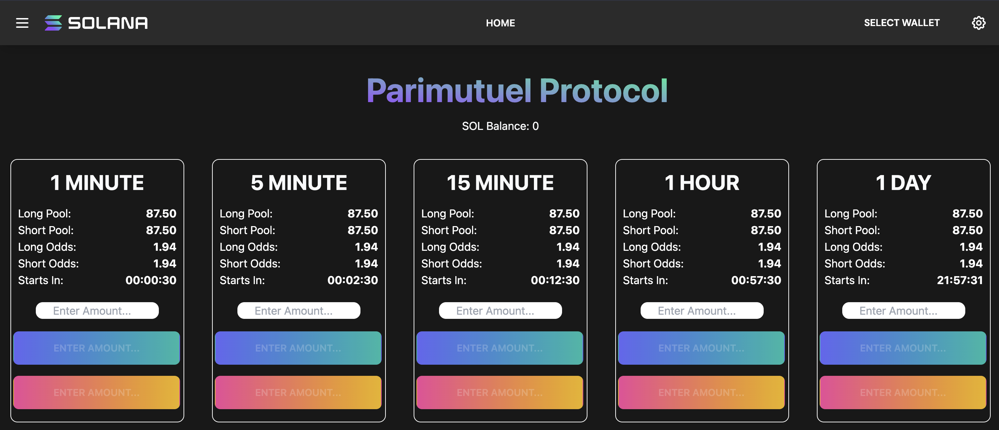
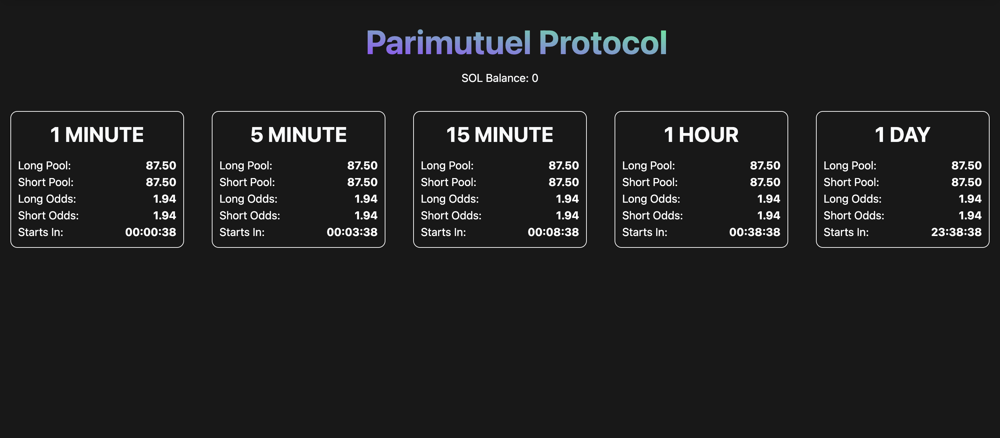
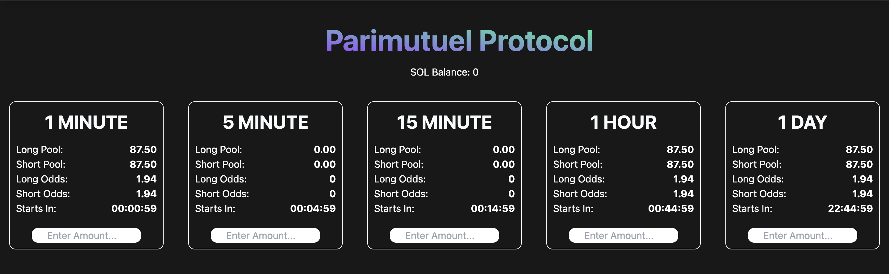

# Hxro Parimutuel TS SDK + React Project

In this project walkthrough, we are going to go through how you can create a dAPP UI that allows users to `place positions`, and many more interactions with the **Hxro TS SDK** and the **Solana web3.js Lib**

Sneak Peek of the app that we are going to build:



# Getting Started:

## **Requirements:**

- Complete the [Typescript SDK Quickstart](https://www.notion.so/Typescript-SDK-QuickStart-090b58f314b04f7ea6b88a1714450b9a), which will help us when extracting the necessary information needed to showcase users
- Clone the **Parimtuel TS Project** [repo](https://github.com/Hxro-Network/parimutuel-ts-project.git)
- Start the project
    1. Run `yarn install` to install all our project dependencies
    2. Run `yarn dev` to run our application

## ****Next Steps:****

Now that we have all the requirements met, it's time to dive into the code and get our hands dirty.

1. We'll begin by changing the branch from **main** to **doc-template**.
2. Our next stop is **`src/views/home/index.tsx`**, which will be the home of our homepage view.

With the groundwork laid, it's time to set up our files:

1. Navigate to the **`components`** folder under **`src`**.
2. Here, we'll create four new files with the **`.tsx`** extension:
    1. `Config.tsx` - This is where we are going to set our global `config` variable for the `ParimutuelWeb3` connection
    2. **`PariBox.tsx`** - This component will be used for each parimutuel market we want to add.
    3. **`PlacePositionBox.tsx`** - This component will handle the amount a user wants to set for a trade and make the call to the PlacePosition component to place the trade.
    4. **`PlacePosition.tsx`** - This component will handle the placement of the position and send a transaction request to the user's wallet.

# Config.tsx

Inside of here import the `DEV_CONFIG` to interact with the devnet parimutuel protocol and for mainnet it’s going to be `MAINNET_CONFIG` and exporting PariConfig to use it through our project

```tsx
import { DEV_CONFIG, MAINNET_CONFIG } from "@hxronetwork/parimutuelsdk";

export const PariConfig = {
config: DEV_CONFIG
}
```

# **PariBox.tsx**

## **Importing Dependencies**

We are going to start by importing the necessary dependencies that we need for our **`PariBox`** component.

We'll be utilizing the following dependencies:

```tsx
import { useConnection } from "@solana/wallet-adapter-react";
import { FC, useState } from "react";
import {
ParimutuelWeb3,
MarketPairEnum,
getMarketPubkeys,
calculateNetOdd,
} from "@hxronetwork/parimutuelsdk";
import { useEffect } from "react";
import { PariConfig } from "./Config";
```

With these dependencies in place, we're ready to start building our **`PariBox`** component.

As we dive into the exciting part, let's first prepare some essential elements under our imports that we'll be utilizing later on:

1. We'll be creating a **`PariObj`** interface to store the contest information, including the Long and Short Pools' amounts, odds, and pubkey.

```tsx
interface PariObj {
    longPool: any; // This is how much money is in the Long Pool of the contest
    shortPool: any; // This is how much money is in the Short Pool of the contest
    longOdds: string; // This is the weighted odds of the Long Pool
    shortOdds: string; // This is the weighted odds of the Short Pool
    pubkey: string; // This is the contest pubkey
}
```

1. Next, we'll create a constant named **`TimeInterval`** to store various time intervals for ease of use.

```tsx
const TimeInterval = [
    {
        interval: '1M',
        seconds: 60,
        title: "1 MINUTE",
    },

    {
        interval: '5M',
        seconds: 300,
        title: "5 MINUTE",
    },

    {
        interval: '15M',
        seconds: 900,
        title: "15 MINUTE",
    },

    {
        interval: '1H',
        seconds: 3600,
        title: "1 HOUR",
    },
    {
        interval: '1D',
        seconds: 86400,
        title: "1 DAY",
    },
];
```

## Setting up our component

1. Start by creating a functional component called **`PariBox`**. It will take in a prop called **`time`**.

```tsx
export const PariBox: FC<{ time: string }> = (props) => {
    const { time } = props;
```

1. Next, we'll filter the **`TimeInterval`** array to find the object that matches the **`time`** prop passed in.

```tsx
    const selectedTime = TimeInterval.filter((data) => data.interval === time);
```

1. We'll extract the **`seconds`** and **`title`** properties from the selected object.

```tsx
    const timeSeconds = selectedTime[0].seconds
    const timeTitle = selectedTime[0].title
```

1. Define a state variable to store the PariObj data. The **`useState`** hook is used to manage this state in the function component.

```tsx
const [pariObj, setPariObj] = useState<PariObj>();
```

1. Define a state variable to store the countDownTime data. The **`useState`** hook is used to manage this state in the function component.

```tsx
const [countDownTime, setCountDownTime] = useState<string>("");
```

1. Create a constant **`config`** that holds the configuration values imported from our `Config.tsx` file

```tsx
const { config } = PariConfig;
```

1. Then create constant `**connection**` that handles the connection to Solana depending on the user's wallet, and instantiate a new **`ParimutuelWeb3`** object with **`config`** and **`connection`** as parameters.

```tsx
const { connection } = useConnection();
const parimutuelWeb3 = new ParimutuelWeb3(config, connection);
```

1. Define the **`marketPair`** with `**MarketPairEnum**` to select the market that we want to get the **contests** from; for **`markets`** we use the `**getMarketPubkeys**` method to get all of the **Pubkeys** of the specified **market/s**, and create a **`marketsByTime`** variable that filters the **`markets`** based on if the duration is the same as **`timeSeconds`** value so that we get only the contests from the **time interval** that we want.

```tsx
// To get only the BTC-USD Market Contests
const marketPair = MarketPairEnum.BTCUSD; 

const markets = getMarketPubkeys(config, marketPair);
const marketsByTime = markets.filter(
    (market) => market.duration === timeSeconds
);
```

## Getting our contest data

1. Use the **`useEffect`** hook to run a specific effect when the component is rendered. In this case, the effect will fetch data about the contest and set it in the **`pariObj`** state.

```tsx
useEffect(() => {
    const getPariData = async () => {

				// make sure that we don't exceed the localStorage 10MB capacity when 
				// calling our data
				localStorage.clear(); 

        // Fetch contest data and set it in the pariObj state
    };
    fetchData();
}, []);
```

### Retrieving contests

1. Use the **`parimutuelWeb3.getParimutuels`** method to retrieve the parimutuel data from the **`parimutuels`** array **`marketsByTerm`** , and retrieve the duration of the selected parimutuel market

```tsx
    const parimutuels = await parimutuelWeb3.getParimutuels(marketsByTime);
    const duration = marketsByTime[0].duration;
```

1. Use the **`parimutuelWeb3.getMarkets`** method to retrieve the market data.

```tsx
    const getMarkets = await parimutuelWeb3.getMarkets(market)
```

1. Filter the **`parimutuels`** array to find the parimutuel accounts that match the conditions to retrieve only the next-in-line contests.

```tsx
    const pari_markets = parimutuels.filter(
        (account) =>
            account.info.parimutuel.timeWindowStart.toNumber() > Date.now() &&
            account.info.parimutuel.timeWindowStart.toNumber() <
            Date.now() + duration * 1000
    );
```

### Extracting data from contests

- **Assigning data to variables:**

```tsx
// Assign active long and active short pools and divide them by USDC 
// decimal size to get the real amount
        let longPool: any =
            (pari_markets[0].info.parimutuel.activeLongPositions.toNumber() /
            1_000_000_000);
        let shortPool: any =
            (pari_markets[0].info.parimutuel.activeShortPositions.toNumber() /
            1_000_000_000);

// Calculate the odds for long and short pools with the 
// calculateNetOdds(side, totalPool, rake) method from the SDK 
// by passing it in the respective pool side, total pool size, 
// and the rake which is the fee that the Parimutuel protocol takes which is 3%
				const longOdds = calculateNetOdd(longPool, longPool + shortPool, 0.03);
        const shortOdds = calculateNetOdd(shortPool, longPool + shortPool, 0.03);

// Get the public key of the selected parimutuel contract and turn it 
// into a string
const pubkey = pari_markets[0].pubkey.toString();

// Get the lock time of the selected parimutuel contract
        const locksTime =
            pari_markets[0].info.parimutuel.timeWindowStart.toNumber();

// Round the values of long and short pools to 2 decimal places
//
        longPool = longPool.toFixed(2)
        shortPool = shortPool.toFixed(2)

// Now we can update our contest by setting the state of our pariObj 
// object with this data
				setPariObj({ longPool, shortPool, longOdds, shortOdds, pubkey });
```

- **Formatting countdown timer to display:**

```tsx
// We declare a variable formattedTime and initialize it with "00:00:00".
var formattedTime = "00:00:00";

// Next, we have an if statement that checks if locksTime is truthy.
if (locksTime) {

//If locksTime is truthy, we calculate the difference between locksTime 
// and the current time in milliseconds. We store this difference in the 
// timeDiff variable.
const currentTime = new Date().getTime();
const timeDiff = locksTime - currentTime;

// We then use the Math.floor method to calculate the number of hours,
// minutes, and seconds from timeDiff.
const hours = Math.floor(timeDiff / (1000 * 60 * 60));
const minutes = Math.floor((timeDiff % (1000 * 60 * 60)) / (1000 * 60));
const seconds = Math.floor((timeDiff % (1000 * 60)) / 1000);

// Next, we use template literals to format hours, minutes, and seconds
// into a string that has the format "hh:mm:ss". If hours, minutes, or
// seconds is less than 10, we add a leading "0".
formattedTime = `${hours < 10 ? "0" + hours : hours}:${minutes < 10 ? "0" + minutes : minutes
                        }:${seconds < 10 ? "0" + seconds : seconds}`;
}

// Finally, we can setCountDownTime with formattedTime as its argument.
setCountDownTime(formattedTime);

};
```

Here we can close our `getPariStats()` function

### Calling our data

To start a recurring function call, we can use the **`setInterval()`** function. The **`setInterval()`** function takes two parameters: the first parameter is the function that you want to call repeatedly, and the second parameter is the interval in milliseconds.

Here, we want to call the **`getPariData()`** function every second, so the interval is set to 1000 milliseconds or 1 second.

```tsx
const intervalId = setInterval(() => getPariData(), 1000);
```

It's important to clean up any recurring functions when the component that started it unmounts, to avoid memory leaks. To do this, we can return a function that calls **`clearInterval()`** and pass in the **`intervalId`**.

```tsx
return () => clearInterval(intervalId);

}, []);
```

So now, we have a function that updates our data every second until the component unmounts and the interval is cleared.

## Rendering Our Data

Now, let's build the UI of our Pari Box component.

```tsx
return (
    // Render contents here
);
```

To make it easier for you, here is the code you can copy & paste inside of `return`:

```tsx
return (
        <div>
            <div style={{
                padding: 10,
                border: "1px solid white",
                borderRadius: "10px",
                boxSizing: "border-box",
                width: "250px",
                alignItems: "center",
            }}>
                <h1 style={{fontWeight: 'bold', fontSize:'30px', marginBottom:'10px'}}>{timeTitle}</h1>
                <div
                    style={{
                        display: "flex",
                        flexDirection: "row",
                        justifyContent: "space-between",
                        alignItems: "center",
                    }}
                >
                    <div
                        style={{
                            display: "flex",
                            flexDirection: "column",
                            alignItems: "flex-start",
                            marginRight: "5px",
                        }}
                    >
                        <p style={{ color: "white" }}>Long Pool:</p>
                        <p style={{ color: "white" }}>Short Pool:</p>
                        <p style={{ color: "white" }}>Long Odds:</p>
                        <p style={{ color: "white" }}>Short Odds:</p>
                        <p style={{ color: "white" }}>Starts In:</p>
                    </div>
                    <div
                        style={{
                            display: "flex",
                            flexDirection: "column",
                            alignItems: "flex-end",
                            marginLeft: "5px",
                        }}
                    >
                        <p style={{ color: "white", fontWeight: "bold" }}></p>
                        <p style={{ color: "white", fontWeight: "bold" }}>
                            {pariObj ? pariObj.longPool : "0"}
                        </p>
                        <p style={{ color: "white", fontWeight: "bold" }}>
                            {pariObj ? pariObj.shortPool : "0"}
                        </p>
                        <p style={{ color: "white", fontWeight: "bold" }}>
                            {pariObj ? pariObj.longOdds : "0"}
                        </p>
                        <p style={{ color: "white", fontWeight: "bold" }}>
                            {pariObj ? pariObj.shortOdds : "0"}
                        </p>
                        <p style={{ color: "white", fontWeight: "bold" }}>{countDownTime}</p>
                    </div>
                </div>
{/* 

Here is where we are going to be using the PlacePositionBox.tsx component

                <div style={{marginTop:'20px'}}>
                   <PlacePositionBox pubkey={pariObj? pariObj.pubkey : 'Loading'}/>
                </div>
*/}
            </div>

        </div>
);
```

## Now, let us test it!

1. Head to `src/view/home.tsx` and import PariBox.tsx
2. Import our PariBox component

```tsx
//Pari Box
import { PariBox } from '../../components/PariBox';
```

1. Use it inside of our HomeView return, and lets pass in `‘1M’` as our time prop to get only the 1 min market contests for BTC-USD.

```tsx
<div className="mx-5 my-5 mb-5 md:mb-0"><PariBox time={'1M'} /></div>
```

### **Bonus:**

You can use the following code to display (in a responsive way) the latest contests for all the **time intervals** available:

```tsx
			<div className="text-center" style={{ alignContent: 'center' }}>
          <div className="flex flex-col items-center justify-between md:flex-row">
            <div className="mx-5 my-5 mb-5 md:mb-0"><PariBox time={'1M'} /></div>
            <div className="mx-5 my-5 mb-5 md:mb-0"><PariBox time={'5M'} /></div>
            <div className="mx-5 my-5 mb-5 md:mb-0"><PariBox time={'15M'} /></div>
            <div className="mx-5 my-5 mb-5 md:mb-0"><PariBox time={'1H'} /></div>
            <div className="mx-5 my-5 mb-5 md:mb-0 md:mb-0"><PariBox time={'1D'} /></div>
          </div>
			</div>
```

And you should have something like this:



# PlacePositionBox.tsx

Now head to `src/components/PlacePositionBox.tsx`  where we will be building our next component to handle under inputs

## Importing Dependencies:

- In the top of our file we are going to import the following dependencies:

```tsx
import { PositionSideEnum } from '@hxronetwork/parimutuelsdk';
import React, { FC, useState } from 'react';
import { useEffect } from 'react';
```

## Setting up our component

1. Define the component **`PlacePositionBox`** using the functional component syntax and destructuring the **`props`** object for **`pubkey`**:

```tsx
const PlacePositionBox: FC<{ pubkey: string }> = (props) => {
    const { pubkey } = props
```

1. Use the **`useState`** hook to initialize the state for **`inputValue`** and **`amount`**. Set the initial value for **`inputValue`** to **`'Enter Amount...'`** and for **`amount`** to **`'0'`**:

```tsx
		const [inputValue, setInputValue] = useState('Enter Amount...');
    const [amount, setAmount] = useState('0')
```

1. Use the **`useEffect`** hook to specify the component should re-render whenever the **`pubkey`** changes:

```tsx
		useEffect(() => {
    }, [pubkey]);
```

1. If the **`pubkey`** is equal to **`'Loading'`**, return a loading message:

```tsx
		if (pubkey === 'Loading') {
        return (
            <div>
                Loading...
            </div>
        )
    }
```

1. Define a **`handleChange`** function that sets the **`inputValue`** and **`amount`** to the value of the **`event.target.value`**:

```tsx
		const handleChange = (event) => {
        setInputValue(event.target.value);
        setAmount(event.target.value);
```

1. Now we need to handle the change of the input value by creating the **`handleChange`** function. The **`handleChange`**  function updates the input value with the entered amount using the **`setInputValue`** hook and sets the same value to **`amount`** with the **`setAmount`** hook. If the input value is empty, it sets the **`inputValue`** back to the placeholder text "Enter Amount...".

```tsx
const handleChange = (event) => {
    setInputValue(event.target.value);
    setAmount(event.target.value);
    if (!event.target.value) {
      setInputValue('Enter Amount...');
    }
};
```

## Returning our component:

Finally, we return the component, which is a **`div`** that contains the input field and the two buttons for LONG and SHORT positions. The input field takes the value from **`inputValue`** and the **`onChange`** event is set to **`handleChange`** function. The styles for the input field are also set using inline styling.

```tsx
return (
    <div style={{ textAlign: 'center' }}>
        <input
            type="number"
            value={inputValue}
            onChange={handleChange}
            placeholder={inputValue}
            style={{ color: 'black', borderRadius: '10px', display: 'inline-block', textAlign: 'center', }}
        />
{/*
Here is where we are going to use the PlacePostion component and 
pass it in amount and pubkey to place the position of the user

        <div style={{ marginLeft: '-15px', marginTop: '10px' }}>
            <PlacePosition amount={amount} pariPubkey={pubkey} side={PositionSideEnum.LONG}/>
            <PlacePosition amount={amount} pariPubkey={pubkey} side={PositionSideEnum.SHORT} />
        </div>
*/}
    </div>
);
};

export default PlacePositionBox;
```

## Now, let us test it!

1. Head over to `src/components/PariBox.tsx` 
2. Import the component into the file

```tsx
import PlacePositionBox from './PlacePositionBox'
```

1. Place it at the bottom of our second div like this:

```
<div style={{marginTop:'20px'}}>
	<PlacePositionBox pubkey={pariObj? pariObj.pubkey : 'Loading'}/>
</div>
```

And now you should have something like this:



# PlacePosition.tsx

Now head to `src/components/PlacePosition.tsx`  where we will be building our next component to handle placing positions

## Importing Dependencies:

1. Import the required dependencies

```tsx
import { useConnection, useWallet } from '@solana/wallet-adapter-react';
import { PublicKey } from '@solana/web3.js';
import { FC, useCallback, useEffect } from 'react';
import { notify } from "../utils/notifications";
import { ParimutuelWeb3, PositionSideEnum, WalletSigner } from '@hxronetwork/parimutuelsdk';
import { PariConfig } from './Config';
```

## Setting up our component

1. Create a functional component **`PlacePosition`** which will take in 3 props **`pariPubkey`**, **`side`**, and **`amount`**

```tsx
const PlacePosition: FC<{pariPubkey: string, side: PositionSideEnum, amount: string}> = (props) => {
  // ...
}
```

1. In the component, use the **`useConnection`** and **`useWallet`** hooks to retrieve the connection and public key. Also, initialize a **`parimutuelWeb3`** instance with the required **`config`** and **`connection`**

```tsx
const { connection } = useConnection();
const { publicKey, signTransaction } = useWallet();
const wallet = useWallet()

const { config } = PariConfig;
const parimutuelWeb3 = new ParimutuelWeb3(config, connection);
```

1. Get the **`pariPubkey`**, **`side`**, and **`amount`** props passed to the component

```tsx
const {pariPubkey, side, amount} = props
```

1. Use the **`useEffect`** hook to run a piece of code whenever the **`pariPubkey`** value changes

```tsx
useEffect(() => {
}, [pariPubkey]);
```

1. Create a **`onClick`** event handler using the **`useCallback`** hook. This event handler will be called when the button is clicked, and it will make a call to the **`parimutuelWeb3.placePosition`** method to place a position. 

The required parameters are:
    - **`wallet`**
    - **`PublicKey(pariPubkey)`**
    - **`parseFloat(amount) * (10 ** 9 / 1)`**
    - **`side`**
    - **`Date.now()`**
    
    If the transaction is successful, a success notification will be displayed, otherwise, an error notification will be displayed.
    

```tsx
const onClick = useCallback(async (amount: string, pariPubkey: string) => {
        if (!publicKey) {
          notify({ type: 'error', message: 'Wallet not connected!' });
          console.error('Send Transaction: Wallet not connected!');
          return;
        }
        let transactionId = '';
        try {
      
          transactionId = await parimutuelWeb3.placePosition(
            wallet as WalletSigner,
            new PublicKey(pariPubkey),
            parseFloat(amount) * (10 ** 9 / 1),
            side,
            Date.now()
          );
      
          if (transactionId) {
            console.log(`Transaction: ${transactionId}`);
            notify({ type: 'success', message: `Placed ${side === PositionSideEnum.LONG ? 'LONG' : 'SHORT'} Position`, txid: transactionId });
          }
        } catch (error) {
          notify({ type: 'error', message: 'Transaction failed!', description: error.message, txid: transactionId });
          console.error(`Transaction failed! ${error.message}`, transactionId);
          return;
        }
      }, [publicKey, notify, connection, signTransaction]);
```

1. Using **`side`** to determine the color gradient of the button. If the side is equal to **`PositionSideEnum.LONG`**, the button will have a gradient from purple to teal. If the side is equal to **`PositionSideEnum.SHORT`**, the button will have a gradient from pink to yellow.

```tsx
const bgGradientClass =
    side === PositionSideEnum.LONG
      ? 'bg-gradient-to-r from-indigo-500 to-teal-500 hover:from-teal-500 hover:to-indigo-500'
      : 'bg-gradient-to-r from-pink-500 to-yellow-500 hover:from-yellow-500 hover:to-pink-500';
```

## Returning our component

Now that we handled everything else we can return the following to get our PlacePosition button set up

```tsx
return (
        <div>
            <button
                className={`group w-60 m-2 btn disabled:animate-none bg-gradient-to-r ${bgGradientClass} ...`}
                onClick={() => onClick(amount, pariPubkey)} disabled={amount === '0'}
            >
                <div className="hidden group-disabled:block ">
                    Enter Amount...
                </div>
                <span className="block group-disabled:hidden" > 
                   {amount} USDC {side === PositionSideEnum.LONG? 'LONG' : 'SHORT'}
                </span>
            </button>
        </div>
    );
};
```

This button checks if the user inputted any amount or not and if not it will block the user from placing a position (ps: it’s not perfect)

## Now, let us test it!

1. Head over to `src/components/PlacePostionBox.tsx`
2. Import PlacePosition from our component

```tsx
import PlacePosition from './PlacePosition'
```

1. Place 2 instances of `PlacePosition` under the `<input/>`  element, one for placing Long positions and the other one for Shorts, and pass in `amount` as the `amount` prop, `pubkey` as the `pariKey` prop, and a `PositionSideEnum` for each side for the `side` prop

```tsx

<div style={{ marginLeft: '-15px', marginTop: '10px' }}>
		<PlacePosition amount={amount} pariPubkey={pubkey} side={PositionSideEnum.LONG}/>
		<PlacePosition amount={amount} pariPubkey={pubkey} side={PositionSideEnum.SHORT} />
</div>
```

And that’s it, if you run your application you should be able to see this:


Now you and any of your users can set their position amounts and place positions for whichever side they want for the time interval that they selected in the BTC-USD Devnet Parimutuel Market

**Up Next:** V2 of this Parimutuel UI Project Walkthrough with more functionalities from the Parimutuel TS SDK